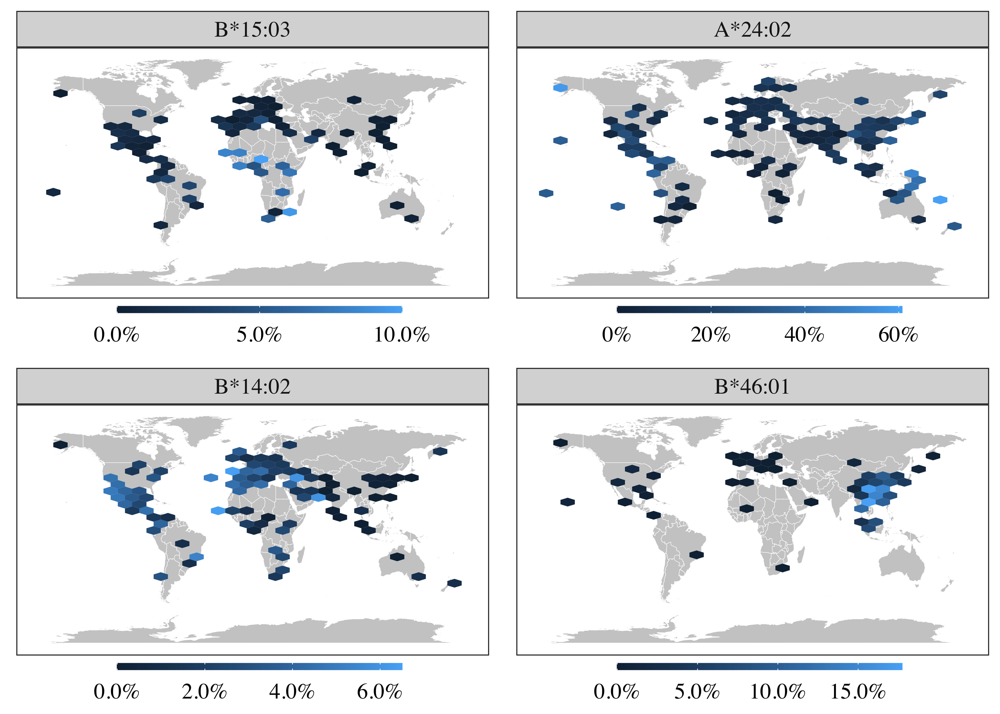
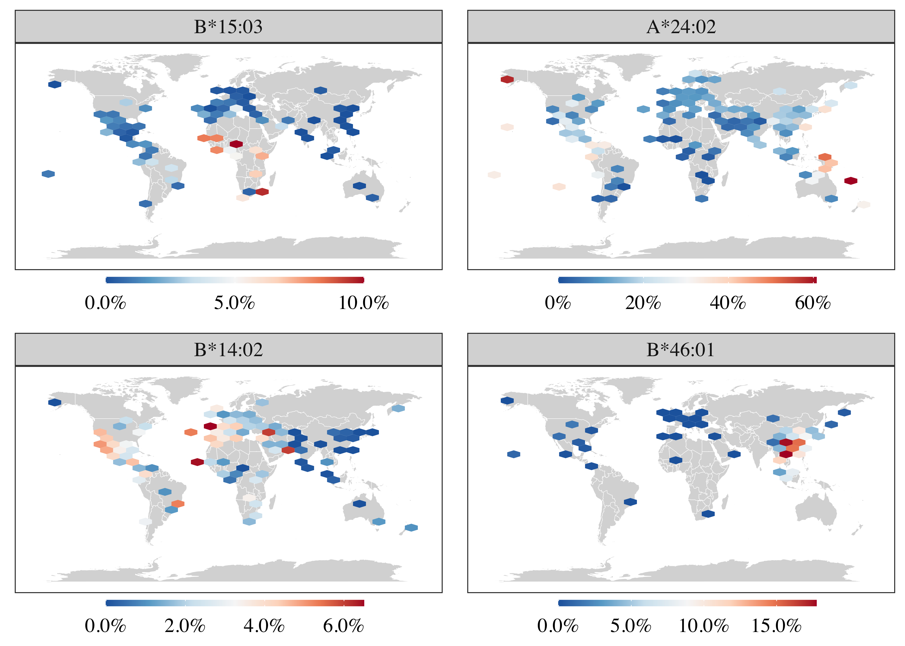

```{r setup, include=FALSE}
knitr::opts_chunk$set(echo = TRUE, message = FALSE, warning = FALSE, comment = "")
```


### Pacotes utilizados

```{r pkgs}
library(tidyverse)
library(rvest)
#instalações também requeridas: 
# install.packages(c("hexbin", "cowplot", "maps"))
```


### Funções

```{r functions}
# obter frequências alélicas do allelefrequencies.net
get_frequency <- function(alleles) {
    
    palleles <- paste(alleles, collapse = ",")
    
    hlaurl <- 
        "http://www.allelefrequencies.net/hla6006a_scr.asp?hla_selection=" %>%
        paste0(palleles)

    hlahtml <- read_html(hlaurl)

    nodes <- html_nodes(hlahtml, "table")
    
    nodes[[3]] %>%
        html_table(fill = TRUE, header = TRUE) %>%
        as_tibble() %>%
        select(allele = Allele, 
               pop = Population, 
               f = `Allele Frequency`,
               n = `Sample Size`,
               location = Location) %>%
        mutate(n = as.integer(gsub(",", "", n)),
               allele = factor(allele, levels = alleles))
}

# plotar mapa com hexagonos
plotmap <- function(df_x) {
    ggplot() +
        geom_map(data = world, map = world,
                 aes(long, lat, map_id = region),
                 color = "white", fill = "grey80", size = .1) +
        stat_summary_hex(data = df_x, 
                         aes(long, lat, z = f)) +
        scale_fill_gradient(NULL,
                            labels = scales::percent,
                            breaks = scales::pretty_breaks(3),
                            guide = guide_colourbar(direction = "horizontal",
                                                    barwidth = 10,
                                                    barheight = .25)) +
        facet_wrap(~allele, ncol = 2) +
        theme_bw() +
        theme(axis.ticks = element_blank(),
              axis.text = element_blank(),
              axis.title = element_blank(),
              panel.grid = element_blank(),
              legend.position = "bottom",
              legend.margin = margin(0, 0, 0, 0),
              legend.box.margin = margin(-10, -10, 0, -10),
              text = element_text(size = 14, family = "Times"))
}
```

### Obter as frequências alélicas

As frequências são capturadas do site do allelefrequencies.net.

Não são consideradas frequências calculadas a partir de frequências fenotípicas assumindo proporções Hardy-Weinberg, apenas as obtidas diretamente. 

```{r data}
alleles <- c("B*15:03", "A*24:02", "B*14:02", "B*46:01")

allele_freqs <- get_frequency(alleles) %>%
    drop_na()

allele_freqs
```

Vamos fazer algumas transformações no dado.

Primeiro precisamos converter os dados de localização pra latitude e longitude.

```{r}
allele_freqs_tidy <- allele_freqs %>%
    separate(location, 
             c("deg_lat", "min_lat", "hem_lat", "deg_lon", "min_lon", "hem_lon"), 
             sep = "_", convert = TRUE) %>%
    mutate(across(starts_with("min"), ~.x/60),
           lat = deg_lat + min_lat,
           long = deg_lon + min_lon,
           lat = ifelse(hem_lat == "S", -lat, lat),
           long = ifelse(hem_lon == "W", -long, long)) %>%
    select(allele, pop, f, n, long, lat)

allele_freqs_tidy
```

E então, quando há diferentes amostras para a mesma localização (latitude e longitude), vamos calcular uma média da frequência ponderada pelo tamanho amostral.

```{r}
allele_freqs_final <- allele_freqs_tidy %>%
    group_by(allele, long, lat) %>%
    summarise(f = weighted.mean(f, n),
              n = sum(n)) %>%
    ungroup()
```

### Gráficos

Os pontos de cada amostragem são projetados no mapa. Para pontos muito próximos, é tomada uma média das frequências (em bins).

#### Opção 1

```{r plot}
world <- map_data("world")

plot_list <- allele_freqs_final %>%
    split(.$allele) %>%
    map(plotmap)

hlamap <- cowplot::plot_grid(plotlist = plot_list, ncol = 2)
ggsave("frequency.png", hlamap, dpi = 600, width = 7, height = 5)

```

#### Opção 2

```{r}
plot_list2 <- allele_freqs_final %>%
    split(.$allele) %>%
    map(~plotmap(.) + 
            ggthemes::scale_fill_gradient2_tableau(trans = "reverse",
                                 labels = scales::percent,
                                 breaks = scales::pretty_breaks(3),
                                 guide = guide_colourbar(direction = "horizontal",
                                                         reverse = TRUE,
                                                         barwidth = 10,
                                                         barheight = .25)) +
        labs(fill = NULL))

hlamap2 <- cowplot::plot_grid(plotlist = plot_list2, ncol = 2)
ggsave("frequency2.png", hlamap2, dpi = 600, width = 7, height = 5)

```


