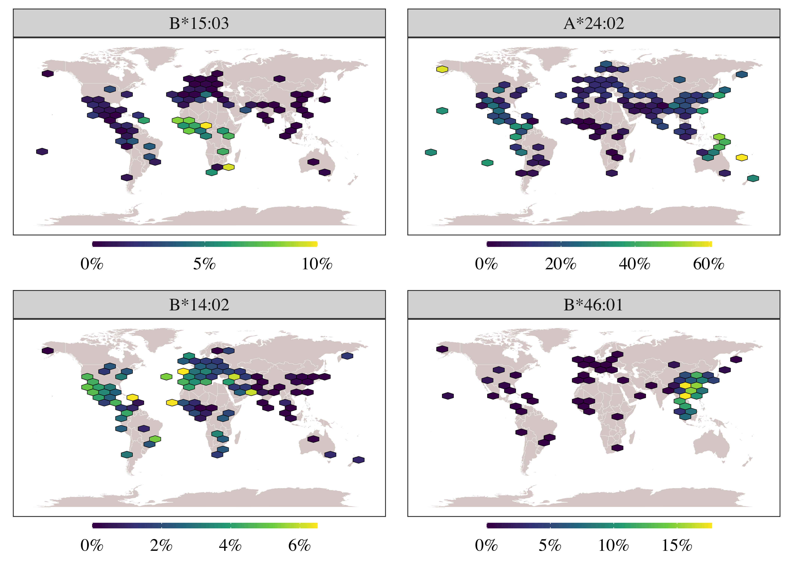

HLA pelo mundo
================

### Pacotes utilizados

``` r
library(tidyverse)
library(rvest)
#instalações também requeridas: 
# install.packages(c("hexbin", "cowplot", "maps"))
```

### Funções

``` r
# obter frequências alélicas do allelefrequencies.net
get_frequency <- function(alleles) {
    
    palleles <- paste(alleles, collapse = ",")
    
    hlaurl <- 
        "http://www.allelefrequencies.net/hla6006a_scr.asp?hla_selection=" %>%
        paste0(palleles)

    hlahtml <- read_html(hlaurl)

    nodes <- html_nodes(hlahtml, "table")
    
    nodes[[3]] %>%
        html_table(fill = TRUE, header = TRUE) %>%
        as_tibble() %>%
        select(allele = Allele, 
               pop = Population, 
               f = `Allele Frequency`,
               n = `Sample Size`,
               location = Location) %>%
        mutate(n = as.integer(gsub(",", "", n)),
               allele = factor(allele, levels = alleles))
}

# plotar mapa com hexagonos
plotmap <- function(df_x) {
    ggplot() +
        geom_map(data = world, map = world,
                 aes(long, lat, map_id = region),
                 color = "white", fill = "grey80", size = .1) +
        stat_summary_hex(data = df_x, 
                         aes(long, lat, z = f)) +
        scale_fill_gradient(NULL,
                            labels = scales::percent,
                            breaks = scales::pretty_breaks(3),
                            guide = guide_colourbar(direction = "horizontal",
                                                    barwidth = 10,
                                                    barheight = .25)) +
        facet_wrap(~allele, ncol = 2) +
        theme_bw() +
        theme(axis.ticks = element_blank(),
              axis.text = element_blank(),
              axis.title = element_blank(),
              panel.grid = element_blank(),
              legend.position = "bottom",
              legend.margin = margin(0, 0, 0, 0),
              legend.box.margin = margin(-10, -10, 0, -10),
              text = element_text(size = 14, family = "Times"))
}
```

### Obter as frequências alélicas

As frequências são capturadas do site do allelefrequencies.net.

Não são consideradas frequências calculadas a partir de frequências
fenotípicas assumindo proporções Hardy-Weinberg, apenas as obtidas
diretamente.

``` r
alleles <- c("B*15:03", "A*24:02", "B*14:02", "B*46:01")

allele_freqs <- get_frequency(alleles) %>%
    drop_na()

allele_freqs
```

    # A tibble: 1,062 x 5
       allele  pop                                          f     n location        
       <fct>   <chr>                                    <dbl> <int> <chr>           
     1 A*24:02 American Samoa                           0.33     51 14_18_S_170_42_W
     2 A*24:02 Argentina Gran Chaco Eastern Toba        0.048   135 26_11_S_58_11_W 
     3 A*24:02 Argentina Gran Chaco Mataco Wichi        0.102    49 27_27_S_58_59_W 
     4 A*24:02 Argentina Gran Chaco Western Toba Pilaga 0        19 27_27_S_58_59_W 
     5 A*24:02 Argentina Rosario Toba                   0.035    86 32_57_S_60_39_W 
     6 A*24:02 Armenia combined Regions                 0.12    100 40_11_N_44_31_E 
     7 A*24:02 Australia Cape York Peninsula Aborigine  0.223   103 10_41_S_142_32_E
     8 A*24:02 Australia Groote Eylandt Aborigine       0.293    75 13_58_S_136_35_E
     9 A*24:02 Australia Kimberly Aborigine             0.083    41 15_46_S_128_44_E
    10 A*24:02 Australia New South Wales Caucasian      0.082   134 33_0_S_146_0_E  
    # … with 1,052 more rows

Vamos fazer algumas transformações no dado.

Primeiro precisamos converter os dados de localização pra latitude e
longitude.

``` r
allele_freqs_tidy <- allele_freqs %>%
    separate(location, 
             c("deg_lat", "min_lat", "hem_lat", "deg_lon", "min_lon", "hem_lon"), 
             sep = "_", convert = TRUE) %>%
    mutate(across(starts_with("min"), ~.x/60),
           lat = deg_lat + min_lat,
           long = deg_lon + min_lon,
           lat = ifelse(hem_lat == "S", -lat, lat),
           long = ifelse(hem_lon == "W", -long, long)) %>%
    select(allele, pop, f, n, long, lat)

allele_freqs_tidy
```

    # A tibble: 1,062 x 6
       allele  pop                                          f     n   long   lat
       <fct>   <chr>                                    <dbl> <int>  <dbl> <dbl>
     1 A*24:02 American Samoa                           0.33     51 -171.  -14.3
     2 A*24:02 Argentina Gran Chaco Eastern Toba        0.048   135  -58.2 -26.2
     3 A*24:02 Argentina Gran Chaco Mataco Wichi        0.102    49  -59.0 -27.4
     4 A*24:02 Argentina Gran Chaco Western Toba Pilaga 0        19  -59.0 -27.4
     5 A*24:02 Argentina Rosario Toba                   0.035    86  -60.6 -33.0
     6 A*24:02 Armenia combined Regions                 0.12    100   44.5  40.2
     7 A*24:02 Australia Cape York Peninsula Aborigine  0.223   103  143.  -10.7
     8 A*24:02 Australia Groote Eylandt Aborigine       0.293    75  137.  -14.0
     9 A*24:02 Australia Kimberly Aborigine             0.083    41  129.  -15.8
    10 A*24:02 Australia New South Wales Caucasian      0.082   134  146   -33  
    # … with 1,052 more rows

E então, quando há diferentes amostras para a mesma localização
(latitude e longitude), vamos calcular uma média da frequência ponderada
pelo tamanho amostral.

``` r
allele_freqs_final <- allele_freqs_tidy %>%
    group_by(allele, long, lat) %>%
    summarise(f = weighted.mean(f, n),
              n = sum(n)) %>%
    ungroup()
```

### Gráficos

Os pontos de cada amostragem são projetados no mapa. Para pontos muito
próximos, é tomada uma média das frequências (em bins).

#### Opção 1

``` r
world <- map_data("world")

plot_list <- allele_freqs_final %>%
    split(.$allele) %>%
    map(plotmap)

hlamap <- cowplot::plot_grid(plotlist = plot_list, ncol = 2)
ggsave("frequency.png", hlamap, dpi = 600, width = 7, height = 5)

```

<!-- -->

#### Opção 2

``` r
plotmap2 <- function(df_x) {
    ggplot() +
        geom_map(data = world, map = world,
                 aes(long, lat, map_id = region),
                 color = "white", fill = "grey80", size = .1) +
        stat_summary_hex(data = df_x, 
                         aes(long, lat, z = f)) +
        ggthemes::scale_fill_gradient2_tableau(trans = "reverse",
                                               labels = scales::percent,
                                               breaks = scales::pretty_breaks(3),
                                               guide = guide_colourbar(direction = "horizontal",
                                                                       reverse = TRUE,
                                                                       barwidth = 10,
                                                                       barheight = .25)) +
        facet_wrap(~allele, ncol = 2) +
        theme_bw() +
        theme(axis.ticks = element_blank(),
              axis.text = element_blank(),
              axis.title = element_blank(),
              panel.grid = element_blank(),
              legend.position = "bottom",
              legend.margin = margin(0, 0, 0, 0),
              legend.box.margin = margin(-10, -10, 0, -10),
              text = element_text(size = 14, family = "Times")) +
        labs(fill = NULL)
}

plot_list2 <- allele_freqs_final %>%
    split(.$allele) %>%
    map(plotmap2)

hlamap2 <- cowplot::plot_grid(plotlist = plot_list2, ncol = 2)
ggsave("frequency2.png", hlamap2, dpi = 600, width = 7, height = 5)
knitr::include_graphics("frequency2.png")
```

<!-- -->

#### Opção 3

``` r
plotmap3 <- function(df_x) {
    ggplot() +
        geom_map(data = world, map = world,
                 aes(long, lat, map_id = region),
                 color = "grey80", fill = "antiquewhite", alpha = .5, size = .1) +
        stat_summary_hex(data = df_x, 
                         aes(long, lat, z = f), color = "grey50", size = .15) +
        ggthemes::scale_fill_gradient2_tableau("Red-Black Diverging", 
                                               trans = "reverse",
                                               labels = scales::percent,
                                               breaks = scales::pretty_breaks(3),
                                               guide = guide_colourbar(direction = "horizontal",
                                                                       reverse = TRUE,
                                                                       barwidth = 10,
                                                                       barheight = .25)) +
        facet_wrap(~allele, ncol = 2) +
        theme_bw() +
        theme(axis.ticks = element_blank(),
              axis.text = element_blank(),
              axis.title = element_blank(),
              panel.grid = element_blank(),
              panel.background = element_rect(fill = "aliceblue"),
              legend.position = "bottom",
              legend.margin = margin(0, 0, 0, 0),
              legend.box.margin = margin(-10, -10, 0, -10),
              text = element_text(size = 14, family = "Times")) +
        labs(fill = NULL)
}

plot_list3 <- allele_freqs_final %>%
    split(.$allele) %>%
    map(plotmap3)

hlamap3 <- cowplot::plot_grid(plotlist = plot_list3, ncol = 2)
ggsave("frequency3.png", hlamap3, dpi = 600, width = 7, height = 5)
knitr::include_graphics("frequency3.png")
```

<!-- -->
