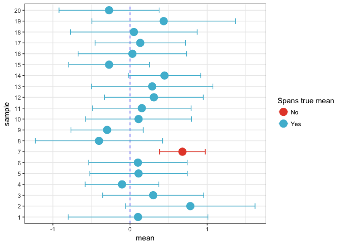

``` r
library(magrittr)
library(ggplot2)

n_samples <- 20
samples_size <- 10
conf_level <- 0.95
mult <- qt((1 + conf_level)/2, samples_size - 1)
  
data <-
  tibble::tibble(sample = factor(rep(1:n_samples, each = samples_size)), 
                 value = c(replicate(n_samples, rnorm(samples_size)))) %>%
  dplyr::group_by(sample) %>%
  dplyr::summarize(mean = mean(value), se = sd(value)/sqrt(samples_size)) %>%
  dplyr::mutate(ci.low = mean - mult*se, ci.upp = mean + mult*se,
                spans_mean = 0 >= ci.low & 0 <= ci.upp)
```

``` r
ggplot(data, aes(color = spans_mean)) + 
  geom_hline(yintercept = 0, color = "blue", linetype = 2) +
  geom_errorbar(aes(x = sample, ymin = ci.low, ymax = ci.upp), width = 0.5) +
  geom_point(aes(sample, mean), size = 5) +
  theme_bw() +
  scale_color_manual(name = "Spans true mean",
                     values = c("FALSE" = ggsci::pal_npg()(1),
                                "TRUE" = ggsci::pal_npg()(2)[2]),
                     labels = c("FALSE" = "No", "TRUE" = "Yes")) +
  coord_flip()
```


