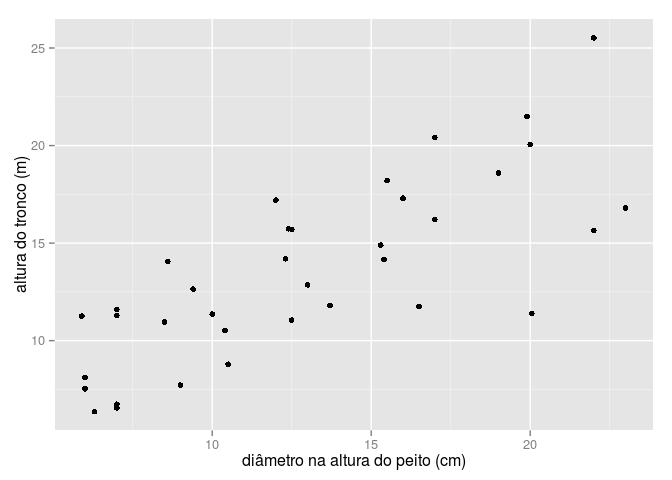
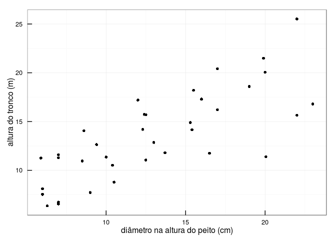
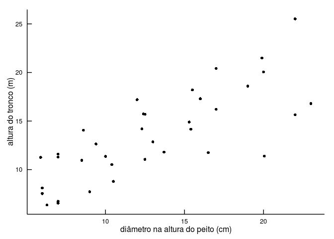
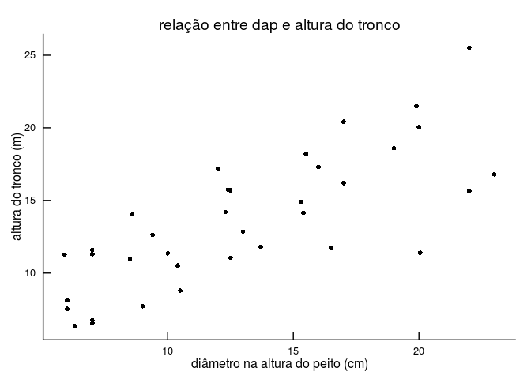
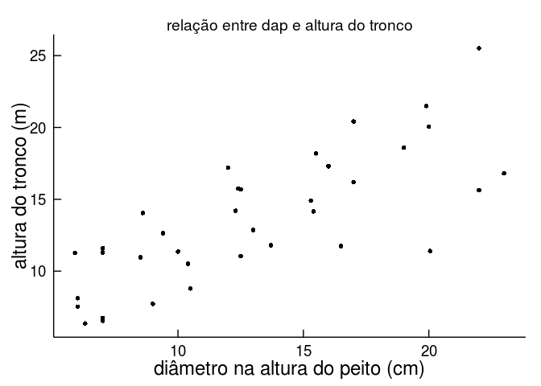
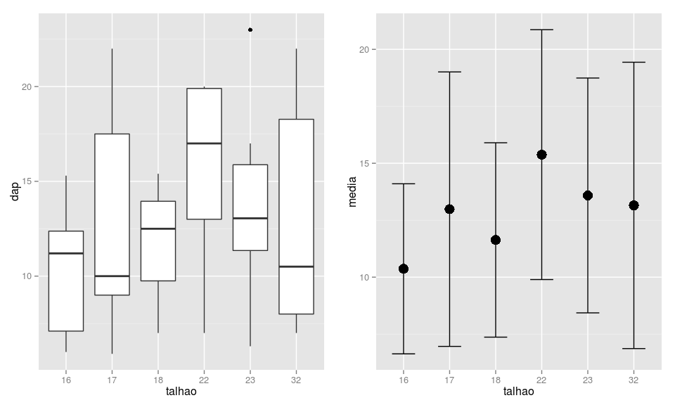
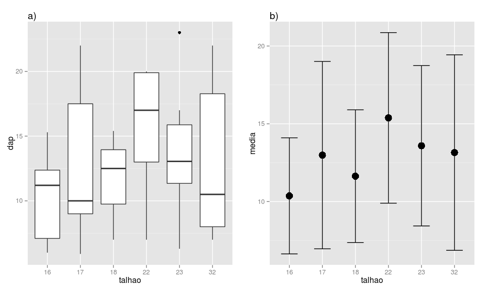
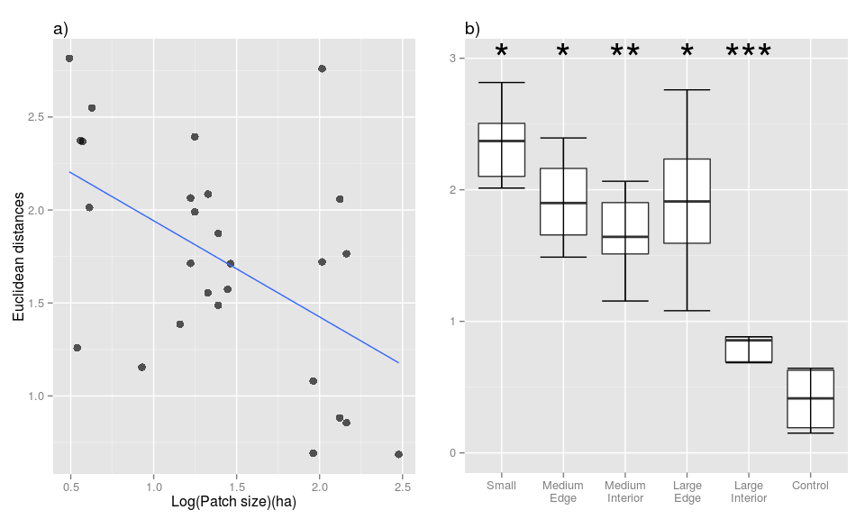

[@vitoaguiar](https://twitter.com/vitoaguiar)

Neste tutorial, vamos usar o pacote `ggplot2` para criar os gráficos do Exercício 5 do curso [*Using R* do Departamento de Ecologia da Universidade de São Paulo](httk://ecologia.ib.usp.br/bie5782/doku.php?id=start). Se você não tem esse pacote instalado, a primeira coisa a fazer é instalá-lo e carregá-lo na sessão de R.

``` r
install.packages("ggplot2")
```

``` r
library(ggplot2)
library(grid)
```

A estrutura básica de código para criar um ggplot é a seguinte:

``` r
ggplot(my_data_frame, aes(x, y)) + geom()
```

Primeiro criamos um plot com a função `ggplot`. O primeiro argumento é `data`, onde você especifica o *data frame* com suas variáveis. Depois vem o `mapping`. Nele você cria o "mapeamento" das variáveis, normalmente usando `aes` (de *aesthetics*). Ou seja, você especifica quais são as variáveis dos eixos *x* e *y*, além de outras opções como cores e símbolos usados para plotar os dados.

Depois da função `ggplot`, nós especificamos um *geom*. Por exemplo, `geom_point` para plotar pontos, `geom_boxplot` para um boxplot, etc. Para a lista completa de *geoms* e todas as outras opções do pacote, visite [a página do projeto ggplot2](http://docs.ggplot2.org/0.9.3.1/index.html).

Note que adicionamos um *geom* com um "*+*". No `ggplot2`, nós criamos gráficos em camadas (*layers*), e adicionamos camada a camada com um "*+*".

Pois bem. Agora vamos partir para o exercício!

Vamos usar o dado esaligna:

``` r
esaligna <- read.csv("http://ecologia.ib.usp.br/bie5782/lib/exe/fetch.php?media=dados:esaligna.csv")
```

### 5.1: Editando alguns parâmetros gráficos

Crie um gráfico de dispersão entre `dap` e `ht` com:

**1. Legendas dos eixos com nomes das variáveis e suas unidades**

``` r
# Criar o plot e salvar no objeto 'p'
p <- ggplot(esaligna, aes(x = dap, y = ht)) + 
  geom_point() +
  xlab("diâmetro na altura do peito (cm)") +
  ylab("altura do tronco (m)")

# Execute 'p' para visualizar:
p
```



Note que, assim como a função `plot` do R, também temos argumentos `xlab` e `ylab`, mas aqui eles são adicionados com um "*+*".

**2. Marcações do eixos (ticks) para dentro da área do gráfico**

Como salvamos o plot no objeto `p`, podemos reutilizá-lo e adicionar camadas.

``` r
p + 
  theme_bw() + 
  theme(axis.ticks.length = unit(-0.25, "cm"), 
        axis.ticks.margin = unit(0.5, "cm"))
```



Para colocar os *ticks* para dentro do gráfico, primeiro configuramos o *background* para a cor branca com `theme_bw()` (de *black and white*). Assim podemos visualizar melhor os *ticks*. E então editamos os *ticks* com `theme()` "setando" a opção `axis.ticks.length` com um valor negativo para que os *ticks* fiquem para dentro do gráfico. E então especificamos um valor de 0.5 para o `axis.ticks.margin` para aumentar a distância dos *ticks* para os *tick labels*, assim eles não ficam sobrepostos. Para isso, usamos a função `unit` do pacote `grid`, o qual carregamos no início desse tutorial.

**3. Apenas dois eixos (formato “L”)**

Uma alternativa para criar um gráfico no formato "L" é usar `theme_classic()`. Isso também remove as linhas de grid. É mais fácil adicionar `theme_classic()` antes de `theme()` para evitar apagar as configurações de *ticks* que criamos.

``` r
p <- p + 
  theme_bw() + 
  theme_classic() +
  theme(axis.ticks.length = unit(-0.25, "cm"), 
        axis.ticks.margin = unit(0.5, "cm"))

p
```



**4. Título informativo**

Podemos adicionar um título com `labs()`:

``` r
p <- p + labs(title = "relação entre dap e altura do tronco")

p
```



**5. Tamanho das fontes maiores que o padrão**

Para aumentar o tamanho da fonte, também podemos usar `theme()`. No `ggplot2`, *axis labels* são chamadas de `axis.title` e *tick labels* de `axis.text`.

``` r
p + theme(axis.title = element_text(size = 18),
          axis.text = element_text(size = 14))
```



### 5.2 Dois gráficos juntos

**1. Use as variáveis `dap` e `talhao` para construir dois gráficos, colocando-os lado a lado. O primeiro deve ser um gráfico de desenho de caixa (boxplot) da variável `dap` em função do fator `talhao`. O segundo deve ter apenas a média e uma barra de desvio-padrão do `dap`, para cada `talhao`.**

``` r
# Boxplot
p_box <- ggplot(esaligna, aes(factor(talhao), dap)) +
  geom_boxplot() +
  xlab("talhao")
  
# Para criar o segundo gráfico, vamos primeiro criar um data.frame com as médias
# e desvios padrão para cada talhão:
dat_por_talhao <- data.frame(talhao = sort(unique(esaligna$talhao)), 
                             media = with(esaligna, tapply(dap, talhao, mean)), 
                             sd = with(esaligna, tapply(dap, talhao, sd)))

dat_por_talhao
```

       talhao    media       sd
    16     16 10.36667 3.733452
    17     17 12.98571 6.023960
    18     18 11.63333 4.266536
    22     22 15.38000 5.483794
    23     23 13.58750 5.154315
    32     32 13.15000 6.285499

``` r
# Agora vamos criar o gráfico:
p_media_desvio <- ggplot(dat_por_talhao, aes(factor(talhao), media)) + 
  geom_point(stat = "identity", size = 5) + 
  geom_errorbar(aes(ymin = media - sd, ymax =  media + sd), width = 0.5) +
  xlab("talhao")
```

Vimos algumas coisas novas para criar o gráfico `p_media_desvio`. Dentro de `geom_point()`, especificamos `stat = "identity"`. Isso diz ao ggplot que já estamos dando a ele o valor da média calculada, e que ele não deve calcular isso dos dados. Além disso, usamos `size = 5` para aumentar o tamanho dos pontos no gráfico. Então, adicionamos a barra do desvio padrão com `geom_errorbar()` especificando que queremos que a barra seja desenhada a partir dos pontos `media - sd` até os pontos `media + sd`.

Para colocar ambos os gráficos na mesma janela, vamos usar a função `pushViewport` do pacote `grid`. Primeiro criamos nosso sistema de janelas especificando que queremos 1 linha e 2 colunas, como em `par(mfrow=c(1, 2))`. Depois "imprimimos" cada gráfico em sua posição.

``` r
pushViewport(viewport(layout = grid.layout(1, 2)))
print(p_box, vp = viewport(layout.pos.row = 1, layout.pos.col = 1))
print(p_media_desvio, vp = viewport(layout.pos.row = 1, layout.pos.col = 2))
```



**2. Insira também uma letra para dizer qual é o gráfico “a” e qual é o “b” (tanto faz, quem é um e quem é outro).**

Podemos adicionar a letra com `labs()` na forma de título e, se desejado, usar `hjust = 0` para justificar o título a esquerda:

``` r
pushViewport(viewport(layout = grid.layout(1, 2)))
print(p_box + labs(title = "a)") + theme(plot.title = element_text(hjust = 0)), 
      vp = viewport(layout.pos.row = 1, layout.pos.col = 1))
print(p_media_desvio + labs(title = "b)") + theme(plot.title = element_text(hjust = 0))
      ,vp = viewport(layout.pos.row = 1, layout.pos.col = 2))
```



### 5.3 Adivinhando o código

Vamos criar a versão ggplot da [figura do exercício 5.3](http://ecologia.ib.usp.br/bie5782/lib/exe/detail.php?id=bie5782%3A01_curso_atual%3Aexercicios5&media=bie5782:01_curso2009:material:exercicio3.jpeg)

Primeiro, lemos o dado misterioso:

``` r
dat <- read.csv("http://ecologia.ib.usp.br/bie5782/lib/exe/fetch.php?media=bie5782:01_curso2009:material:exercicio3.csv")
```

E então vamos ao primeiro plot:

``` r
p_a <- ggplot(data = dat, aes(x1, y1)) + 
  geom_point(size = 3, alpha = .65, na.rm = TRUE) + 
  geom_smooth(method = "lm", se = FALSE, na.rm = TRUE) +
  xlab("Log(Patch size)(ha)") +
  ylab("Euclidean distances")
```

Aqui nós usamos em `geom_point()` os argumentos `size = 3` para aumentar um pouco o tamanho dos pontos, `alpha = 0.65` para adicionar uma transparência aos pontos e `na.rm = TRUE` pois o dados tem alguns valores faltantes. Esse último argumento não é necessário, uma vez que o `ggplot2` vai eliminar esses valores automaticamente, nos emitindo uma mensagem de aviso.

Em `geom_smooth()` adicionamos uma linha *smooth* ao plot de acordo com o modelo de regressão linear.

Enfim vamos ao último plot desse tutorial!

``` r
p_b <- ggplot(data = dat, aes(factor(y2), x2)) + 
  ylim(c(0,3)) +
  geom_boxplot(outlier.shape = NA) +
  stat_boxplot(geom ='errorbar') + 
  scale_x_discrete(labels=c("Small", "Medium\nEdge", "Medium\nInterior",
                            "Large\nEdge", "Large\nInterior", "Control")) +
  theme(axis.title = element_blank()) +
  annotate("text", x = 1:6, y = 3, label = c("*", "*", "**", "*", "***", ""), 
           size = 12)
```

Nesse boxplot nós usamos

-   `outlier.shape = NA` para remover outliers do plot
-   `stat_boxplot(geom = "errorbar")` como um truque para adicionar linhas horizontais ao fim dos *whiskers*
-   `scale_x_discrete()` para adicionar os nomes no eixo *x* (*discrete* porque temos um eixo *x* categórico)
-   `theme(axis.title = element_blank())` para remover os *axis labels*
-   `annotate()` para adicionar os asteriscos ao plot.

Para finalizar, colocamos os 2 plots lado a lado com a `pushViewport()` que vimos anteriormente:

``` r
pushViewport(viewport(layout = grid.layout(1, 2)))
print(p_a + labs(title = "a)") + theme(plot.title = element_text(hjust = 0)),
      vp = viewport(layout.pos.row = 1, layout.pos.col = 1))
print(p_b + labs(title = "b)") + theme(plot.title = element_text(hjust = 0)),
      vp = viewport(layout.pos.row = 1, layout.pos.col = 2))
```



\***Note que o comportamento do `ggplot2` para calcular o comprimento dos *whiskers* no boxplot é diferente da função `boxplot` do R. [A página do pacote traz mais detalhes sobre isso](http://docs.ggplot2.org/current/geom_boxplot.html).**
